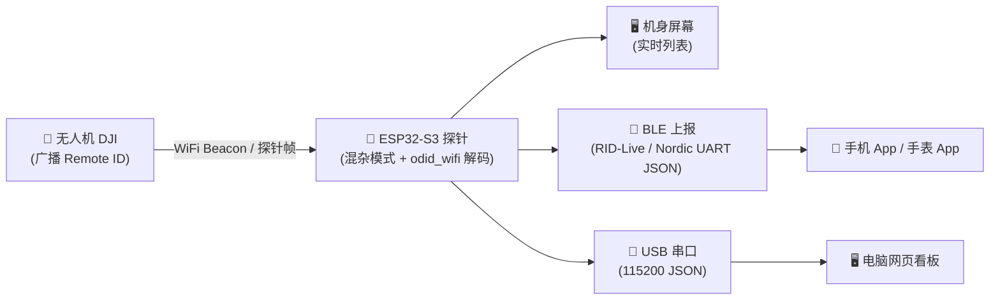

# 🛸 DroneScanner — ESP32-S3 无人机 Remote ID 探针（硬件版）

[](LICENSE)
[](https://www.espressif.com/)
[](https://www.astm.org/f3411-22a.html)

> **开箱即用的无人机探测探针**：基于 ESP32-S3 的成品硬件，开启 WiFi 混杂模式监听无人机广播的 Remote ID 信号，机身屏幕实时显示，并通过蓝牙 / USB 将数据推送到手机、手表、网页看板等多端查看。

---

## 🙏 致谢与说明

感谢各位对项目的关注与支持！

近期个人事务繁忙，未能及时回复大家的留言与私信，在此深表歉意。
经网友反馈，有个别人未经允许直接二改倒卖源码，不遵守GPL 3.0协议，本项目不再公开更新
新入群的可以直接给更新版本的bin固件，不再开放源码
为了方便交流与问题讨论，新建立了一个交流群，欢迎所有对本项目或相关技术感兴趣的朋友加入！

> 📌 **QQ 群号：`1102647907`**

## 📸 界面一览

| 探针屏幕侦测页 | 手机 App 看板 |
|:---:|:---:|
|  |  |

---

## ✨ 功能特性

- **📡 无人机实时侦测** — WiFi 混杂模式捕获无人机广播的 Remote ID 数据包
- **🔍 Open Drone ID 解码** — 完整解析 ASTM F3411-22a Remote ID 协议
- **🏷️ 机型自动识别** — 内置机型库（166 条前缀映射，覆盖 DJI 等主流品牌），自动匹配机型
- **🖥️ 机身屏幕实时列表** — 旋转无人机图标 + SN 序列号 + RSSI 信号，多机排序滚动，一目了然
- **📲 双模数据上报**
  - **蓝牙（Nordic UART）**：手机 / 手表 App 直连探针（BLE 名称 `RID-Live`）收 JSON 快照，无需局域网
  - **USB 串口（115200）**：电脑网页看板 / 调试工具直读 JSON
- **📱 多端查看**
  - Android 双壳 App（蓝牙或 USB 串口直连）
  - 手表看板 App（BLE 直连，息屏震动 / 后台保活）
  - 电脑网页看板（`tools/dashboard.html`）、微信小程序
- **🎮 专业扩展** — 抓包记录 / 回放 / RID 伪造注入测试 / 离线记录
- **🔧 配网与升级** — AP 热点 `Remote_ID_Tool` 进入扩展功能页；屏控款支持 AP 在线 OTA 升级

---

## 📦 硬件版本

| 版本 | 说明 |
|------|------|
| **标配探针** | 主项目固件：屏幕侦测页 + 蓝牙上报 + 抓包 / 伪造 / 记录等全部功能 |
| **屏控款** | 精简屏控界面 + AP 在线 OTA 固件升级，主力日常款 |
| **肩灯警闪款** | 侦测到无人机触发红蓝警闪（WS2812 双路）+ 警笛，适合布防场景 |

**核心硬件**：ESP32-S3 开发板 + ST7735S 128×128 彩色圆屏（可选）+ 2.4GHz 天线

> ✅ 无需任何额外射频硬件 —— 利用 ESP32 自带的 WiFi 控制器即可监听无人机广播。

---

## 🚀 快速开始（成品 / 已烧录版）

### 1️⃣ 上电开机

USB 供电，探针屏幕显示主界面，自动进入 WiFi 混杂模式开始侦测。

### 2️⃣ 手机查看

1. 手机安装 **RID-Android.apk**（`build/` 目录）
2. 打开 App → 开启蓝牙 → 搜索并连接 **`RID-Live`** 探针
3. 无人机起飞后，App 列表 / 地图实时显示：机型、SN、位置、高度、速度

### 3️⃣ 电脑查看

1. 探针 USB 连接电脑（对应串口 115200）
2. 浏览器打开 `tools/dashboard.html`（或运行 `start_dashboard.bat`）
3. 看板显示全量无人机数据与轨迹

### 4️⃣ 开发者编译烧录

编译配置与固件 bin 统一存放于主项目 `编译配置.txt` 与 `build/` 目录
（ESP32-S3 Dev Module，arduino-cli 一键编译，附完整 FQBN 参数）。

---

## ⚙️ 工作原理



1. **混杂模式监听** — 不连接任何路由器，直接监听 2.4GHz 无线信道
2. **过滤 ODID 帧** — 筛选包含 ODID 协议头的 Beacon / 探针帧
3. **协议解码** — `odid_wifi` 提取载荷，`opendroneid` 解码为结构化数据
4. **机型识别** — SN 前缀匹配机型库（`drone_models.csv`，166 条映射）
5. **实时展示** — 机身屏幕 + BLE / USB 双通道推送 JSON 快照（`\n` 分帧，最大 20 架）
6. **多端联动** — 手机 / 手表 / 网页看板任一端接入即用

---

## 🛠️ 配置说明

### 热点与蓝牙（`config.h`）

```cpp
#define AP_SSID       "Remote_ID_Tool"   // 扩展功能 AP 热点
#define AP_PASS       "12345678"         // 热点密码
#define AP_CH         6                  // WiFi 信道
#define BLE_DEV_NAME  "RID-Live"         // 蓝牙广播名（App 搜索此名称连接）
#define MAX_DRONES    20                 // 同时跟踪无人机上限
#define TIMEOUT_MS    30000              // 30s 无信号判定离线
```

### 屏幕接线（`User_Setup.h`）

ST7735S 128×128 彩色圆屏，驱动参数（SPI 引脚 / 颜色顺序）在 `User_Setup.h` 中集中配置。

---

## 🔌 数据接口

探针通过 **USB 串口** 与 **BLE**（Nordic UART：`6e400001-b5a3-f393-e0a9-e50e24dcca9e`）输出同一份 JSON 快照，行尾 `\n` 分帧：

```json
{
  "t": "snap",
  "n": 1,
  "ch": 6,
  "bat": 75,
  "drones": [
    {
      "mac": "AA:BB:CC:DD:EE:FF",
      "rssi": -65,
      "id": "1581F8LQ1234",
      "model": "Mavic 3 Pro",
      "lat": 39.9042,
      "lon": 116.4074,
      "alt": 120.0,
      "ha": 80.0,
      "speed": 5.2,
      "heading": 180,
      "olat": 39.9051,
      "olon": 116.4061,
      "age": 3
    }
  ]
}
```

| 字段 | 说明 |
|------|------|
| `mac` | 无人机 MAC 地址 |
| `rssi` | 信号强度（dBm） |
| `id` | 无人机序列号（UAS ID） |
| `model` | 匹配到的机型名称 |
| `lat` / `lon` | 无人机经纬度（火星坐标） |
| `alt` / `ha` | 海拔 / 相对地面高度（m） |
| `speed` / `heading` | 速度（m/s）/ 航向（°） |
| `olat` / `olon` | 操作员位置（如广播中携带） |
| `age` | 距上次收到信号秒数 |

---

## 🔬 串口日志示例

```
RID v2.4 | AP:Remote_ID_Tool | BLE:RID-Live | 侦测中...
[1] AA:BB:CC:DD:EE:FF RSSI:-60 | 机型:Mavic 3 Pro | 39.9042,116.4074 alt:120m ha:80m
[state] 3 targets | 187 packets
```

---

## ❓ 常见问题

<details>
<summary><b>手机搜不到 RID-Live？</b></summary>

- 确认探针已上电且蓝牙开关开启（可在屏幕菜单查看）
- Android 12+ 需授予 App「附近设备」权限，且系统定位需开启
- 首次使用：连接时同时授权蓝牙 + 位置
</details>

<details>
<summary><b>探测不到无人机？</b></summary>

- 部分机型在地面不广播 Remote ID，需起飞后才有信号
- 无外接天线时探测距离约 100m，靠近无人机试试
- 检查天线是否接好；用屏幕 / 串口日志确认探针在正常收包
</details>

<details>
<summary><b>App 列表一直是空的？</b></summary>

- 确认 App 显示「已连接」（BLE 或 USB 串口 115200）
- 检查屏幕状态栏「总数」是否有数字；有数字但列表空请反馈截图
- USB 直连请确认插的是板载 USB 口（非 UART 转串口 COM 口）
</details>

<details>
<summary><b>如何升级固件？</b></summary>

- 屏控款：进入 OTA 页 → 手机连热点 `RID_Spoofer`（密码 12345678）→ 浏览器 `http://192.168.4.1` → 上传 bin
- 其它款：USB 线刷（arduino-cli / SJ 在线烧录工具）
</details>

---

## 📄 License

本项目基于开源 ODID 库和 ESP32 Arduino 框架开发，**仅用于教育和研究目的**。

- [Open Drone ID](https://github.com/opendroneid) — 开源 ODID 协议实现
- [ASTM F3411-22a](https://www.astm.org/f3411-22a.html) — Remote ID 标准
- [ESP32 Arduino](https://docs.espressif.com/projects/arduino-esp32/en/latest/) — 官方文档

---

## 🙌 交流与支持

- 固件问题、使用操作、功能建议 → 交流群 `1102647907`
- 新机型识别映射（SN 前缀 + 型号）欢迎提供测试数据